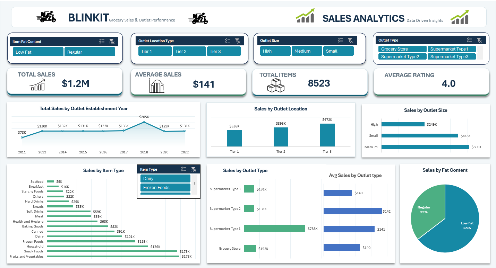

# BlinkIT Grocery Sales & Outlet Performance Dashboard

## 📊 Project Overview

An interactive **Excel dashboard** developed to analyze BlinkIT grocery sales performance across different product categories and outlet characteristics.

The dashboard provides a consolidated view of sales, product performance, outlet performance, and sales trends using interactive filters.

## 🖥️ Dashboard Preview

## 🛠️ Tools & Techniques

- Microsoft Excel
- PivotTables
- PivotCharts
- Slicers
- KPI Cards
- Data Visualization
- Interactive Dashboard Design

## 📌 Key KPIs

| KPI | Value |
|---|---:|
| Total Sales | **$1.20M** |
| Average Sales | **$141** |
| Total Items | **8,523** |
| Average Rating | **4.0** |

## 🔍 Key Findings

- **Tier 3 outlets** recorded the highest sales among outlet locations, at approximately **$472K**.
- **Medium-sized outlets** generated the highest sales among outlet sizes, at approximately **$508K**.
- **Supermarket Type 1** contributed the highest sales among outlet types, at approximately **$788K**.
- **Fruits & Vegetables** was the highest-selling item category, generating approximately **$178K** in sales, followed by **Snack Foods** at approximately **$175K**.
- **Low Fat** products contributed approximately **65%** of total sales, while **Regular** products contributed approximately **35%**.
- Sales by outlet establishment year reached the highest displayed value in **2018**, at approximately **$205K**.

## 🎛️ Dashboard Features

The dashboard includes interactive slicers for:

- Item Fat Content
- Item Type
- Outlet Location Type
- Outlet Size
- Outlet Type
- Outlet Establishment Year

### Visualizations

- Total Sales KPI
- Average Sales KPI
- Total Items KPI
- Average Rating KPI
- Sales by Item Type
- Sales by Outlet Type
- Sales by Outlet Location Type
- Sales by Outlet Size
- Sales by Item Fat Content
- Sales Trend by Outlet Establishment Year

## 🎯 Project Objective

To develop an interactive sales analytics dashboard that enables users to explore grocery sales performance and identify patterns across **products, outlet characteristics, and establishment years**.

## 📁 Files

| File | Description |
|---|---|
| `BlinkIT_Grocery_Sales_Dashboard.xlsx` | Interactive Excel dashboard |
| `BlinkIT_Dashboard.png` | Dashboard preview |

## 💡 Insights

The dashboard demonstrates how Excel-based data visualization and interactive filtering can be used to transform grocery sales data into actionable business insights.
